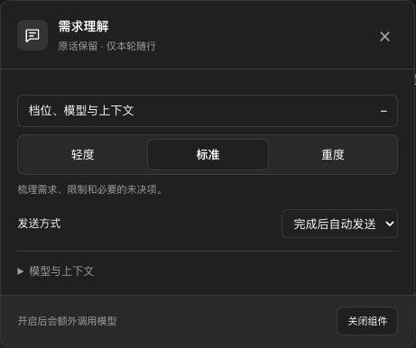

# OMD Prompt Optimizer · 需求理解

**独立、可选的 OMD UI 增强版。默认不安装；手动安装后也默认关闭。**

基于 [WestFox-AwA/dsh-prompt-optimizer](https://github.com/WestFox-AwA/dsh-prompt-optimizer) **0.7.4** 的解释、校验与编译引擎，重新实现 DSH/OMD 适配与界面。上游作者为 **啃轮胎的西狐（WestFox-AwA）**，保留 BSD-3-Clause 许可与署名。这不是上游官方发行版。

你照常输入 → 解释模型梳理本轮需求 → 审查或编辑随行内容 → 原话不动，由 DSH 原生入口发送。

## 界面预览

以下是隔离测试环境的实际界面，使用模拟模型数据，不是效果跑分。




## 安装与启用

优先从 **OMD → 设置 → 推荐插件 → 需求理解 · OMD UI 增强版**手动安装，或下载本仓库 [Release](https://github.com/gulagala001/omd-prompt-optimizer/releases) 中的 `omd-prompt-optimizer-0.1.0.tgz`：

```sh
dsh plugin --profile YOUR_PROFILE add /path/to/omd-prompt-optimizer-0.1.0.tgz
```

按宿主提示重新加载或重启后，打开 **设置 → 需求理解 → 启用需求理解**。只安装不会开启拦截。默认采用“标准 / 审查后发送 / 最近 6 回合 / 不读取项目文件”。

**不要把仓库根目录或原始 `po06/` 当成这个增强版安装。增强版的发行子目录是 `omd/`，只安装本仓库 Release 的上述包。**

## 改进范围

- 紧凑输入入口、分层设置、可编辑的结果卡片、实际 token 用量和可展开的解释模型思考。
- 跟随 OMD 主题、配色、字体和圆角，适配浅色、深色、窄屏、键盘焦点与减少动态效果。
- 复用 DSH 输入组件，不拦截文档全局按键、不根据按钮文字或页面位置猜测发送行为。
- 原话、附件及引用仍由宿主管理；解释结果按会话和本轮输入绑定，不能套用到后来的同文消息。
- 开启后可选择解释模型、轻/标准/重档位、审查/自动、历史范围、只读项目查证及解释层提示词。
- **不携带额外 Bash 运行时，不注册工作模型工具，不修改 OMD 内置提示词优化器或上下文压缩。**

## 关闭的含义

关闭后移除组件的发送包装、原生发送阶段钩子，取消未完成调用、拒收晚到结果，清空待采用的随行内容。输入区入口与其样式、监听器、计时器卸载。关闭的设置页也退出后，没有组件界面样式残留。

仅保留安装文件、配置和设置页入口，以及供手动管理使用的认证 API。启动或打开设置时读取一次配置，不轮询。启用时的同源标签页通过临时广播通道同步关闭；关闭的标签页重新打开设置或刷新时读取最新状态。不同浏览器的关闭由后端即时阻止后续解释和注入，界面状态在下一次交互/刷新时同步。

**这不等于撤销历史：已经发送的内容、已经完成的模型调用和回答不能回到“从未发生”。**不会改写系统提示词、工具清单，或清空/重建 OMD 的缓存；过去已经发出的随行消息仍作为历史保留。

## 隐私与成本

没有遥测或作者回传。开启后，原话、选定历史及允许读取的文件内容会发送至你配置的模型服务；不是“数据永远不离开本机”。历史文字上限为最近回合 12,000 字符或可读历史 60,000 字符，截断会说明。只读工具默认关闭，采用上游的工作目录与真实路径边界。

额外解释、空结果重试与只读工具轮次都会增加调用成本。显示供应商实际用量，缺失值显示 `—`。本版本没有宣称经过真实模型 A/B 测试或保证节省 token。

本组件与 OMD 自带“提示词优化”是两个独立功能。建议避免同时开启两者的自动处理，以免重复调用；如果另一组件改写原话，旧的需求解释不会冒充该新输入的解释。

## 开发与验证

```sh
cd omd
npm ci
npm run build
npm test
```

源码结构：`omd/src/` 是增强版适配与 UI；`po06/lib/` 中使用到的上游解释器、reducer、compiler、pipeline、策略与只读工具保持原样。构建只打包实际依赖，不带原版的生产适配器、额外工具后端或自检触发器。安装包中的 `UPSTREAM.json` 固定来源提交。

真实宿主验证使用独立 OMD checkout 中的隔离测试夹具（测试安装包只进临时 profile）：

```sh
cd omd
npm pack --ignore-scripts
OMD_CHECKOUT=/path/to/oh-my-dsh node --test test/host-ui.test.mjs
```

详细范围与平台限制见 [omd/README.md](omd/README.md)。源码与二进制遵循 [BSD-3-Clause](LICENSE)。
